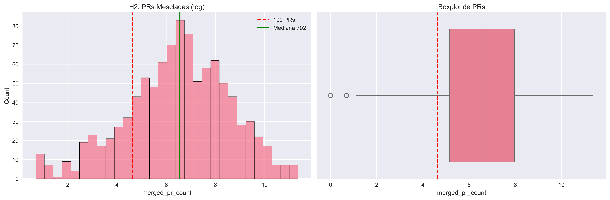
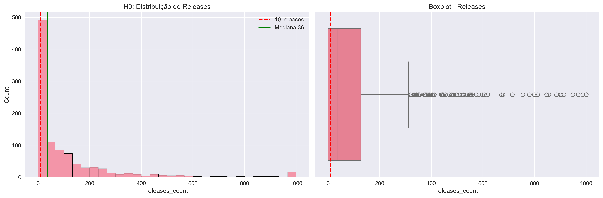
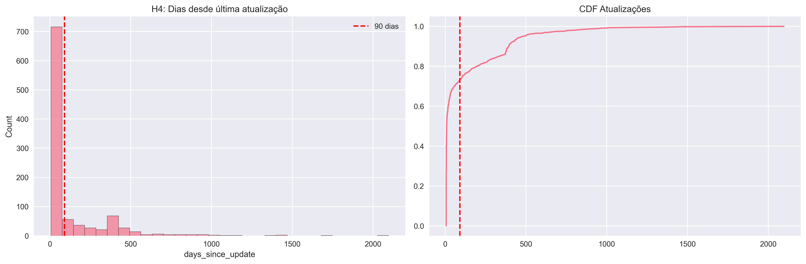
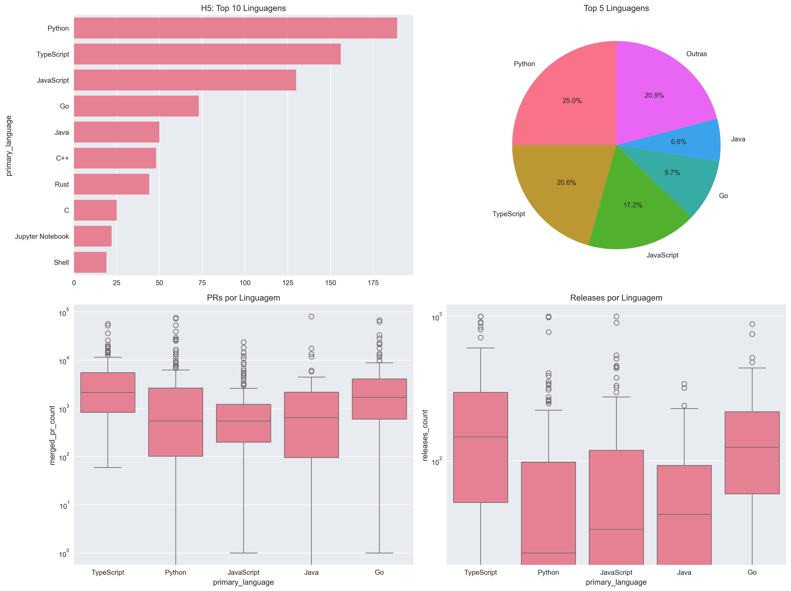
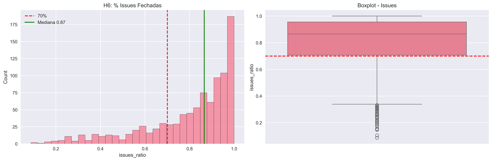
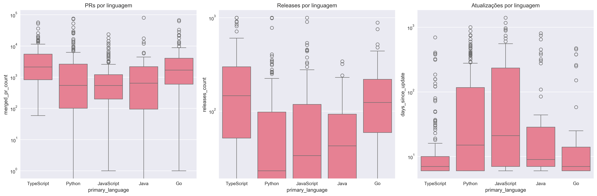

# Relatório Final

## 1. Introdução

Este relatório apresenta a análise de dados dos 1.000 repositórios mais populares do GitHub, com base em métricas extraídas da API.
O objetivo é verificar a validade de hipóteses informais relacionadas à popularidade, contribuidores, releases, atualizações e linguagens.

### Hipóteses / Questões de Pesquisa (RQ)
* RQ01 (H1): Sistemas populares são maduros/antigos (idade > 5 anos).
* RQ02 (H2): Sistemas populares recebem contribuições externas significativas (PRs aceitas mediana > 100).
* RQ03 (H3): Sistemas populares lançam releases com frequência (mediana > 10).
* RQ04 (H4): Sistemas populares são atualizados frequentemente (última atualização ≤ 90 dias).
* RQ05 (H5): Sistemas populares usam linguagens populares (JS, Python, TS).
* RQ06: Sistemas populares possuem alto percentual de issues fechadas.
** Métrica: razão entre número de issues fechadas / total de issues.
* RQ07 (Bônus): Sistemas em linguagens populares recebem mais contribuições, mais releases e atualizações mais frequentes que os outros.

## 2. Metodologia

1. Coleta: API GraphQL do GitHub → top 1000 repositórios com mais estrelas.

2. Processamento: Dados armazenados em CSV e processados com pandas.

3. Métricas Calculadas:

* Idade do repositório (anos desde a criação).
* Dias desde última atualização.
* PRs mesclados.
* Número de releases.
* Linguagem primária.
* Issues fechadas / total de issues.
4. Análises Estatísticas:
* Média, Mediana, Intervalos de Confiança via Bootstrap.
* Testes não-paramétricos (Kruskal-Wallis) para comparação entre linguagens.
5. Visualização: matplotlib e seaborn para histogramas, boxplots, CDFs e comparações por linguagem.

## 3. Resultados

## H1 - Sistemas populares são maduros

## H2: Muita contribuição externa

## H3 - Frequência de Releases

## H4 - Atualizações recentes

## H5 - Linguagens mais utilizadas

## H6 - % de Issues Fechadas

## RQ07 (Bônus) - Comparação entre linguagens

## 4. Discussão

* RQ01: Popularidade está associada a projetos maduros.
* RQ02: Muitos recebem PRs externos, mas há concentração em poucos repositórios grandes.
* RQ03: A frequência de releases varia muito por projeto.
* RQ04: Boa parte é atualizada frequentemente, mostrando manutenção ativa.
* RQ05: Confirma-se dominância de linguagens JS, Python, TS.
* RQ06: Alto percentual de issues fechadas sugere boa gestão de comunidade.
* RQ07: Linguagens populares tendem a apresentar métricas melhores, mas não em todos os aspectos.

## 5. Conclusão
O estudo confirma parcialmente as hipóteses.
Projetos populares no GitHub são em geral maduros, ativos, recebem contribuições externas, possuem releases e usam linguagens líderes de mercado.
Além disso, a análise de issues fechadas reforça a imagem de manutenção ativa.
A estratificação por linguagem mostra que JS, Python e TS concentram grande parte da popularidade, mas não necessariamente dominam em todas as métricas.