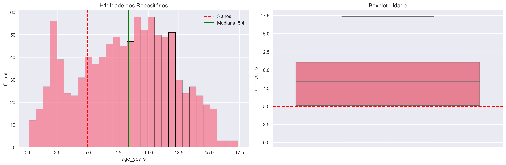

# Relatório Final

## 1. Introdução

Este relatório apresenta a análise de dados dos 1.000 repositórios mais populares do GitHub, com base em métricas extraídas da API GraphQL.
O objetivo é verificar a validade de hipóteses informais relacionadas à popularidade, contribuidores, releases, atualizações e linguagens de programação.

### Hipóteses / Questões de Pesquisa (RQ)
* **RQ01 (H1)**: Sistemas populares são maduros/antigos (idade > 5 anos).
* **RQ02 (H2)**: Sistemas populares recebem contribuições externas significativas (PRs aceitas mediana > 100).
* **RQ03 (H3)**: Sistemas populares lançam releases com frequência (mediana > 10).
* **RQ04 (H4)**: Sistemas populares são atualizados frequentemente (última atualização ≤ 90 dias).
* **RQ05 (H5)**: Sistemas populares usam linguagens populares (JS, Python, TS).
* **RQ06**: Sistemas populares possuem alto percentual de issues fechadas.
  * Métrica: razão entre número de issues fechadas / total de issues.
* **RQ07 (Bônus)**: Sistemas em linguagens populares recebem mais contribuições, mais releases e atualizações mais frequentes que os outros.

## 2. Metodologia

### 2.1 Coleta de Dados
- **Fonte**: API GraphQL do GitHub
- **Amostra**: Top 1.000 repositórios com mais estrelas
- **Métricas coletadas**: Estrelas, forks, watchers, commits, issues, PRs, releases, datas de criação e atualização, linguagens

### 2.2 Processamento
- **Armazenamento**: Dados estruturados em CSV
- **Processamento**: Análise com pandas e numpy

### 2.3 Métricas Calculadas
* **Idade do repositório**: Anos desde a criação até a data de coleta
* **Dias desde última atualização**: Tempo decorrido desde o último push/commit
* **PRs mesclados**: Número total de pull requests aceitos
* **Número de releases**: Versões oficiais lançadas
* **Linguagem primária**: Linguagem principal do repositório
* **Razão de issues fechadas**: Issues fechadas / total de issues

### 2.4 Análises Estatísticas
* **Estatísticas descritivas**: Média, mediana, desvio padrão, quartis
* **Intervalos de Confiança**: Bootstrap com 5.000 amostras (IC95%)
* **Testes não-paramétricos**: Kruskal-Wallis para comparação entre linguagens
* **Análise de proporções**: Teste de Wilson para percentuais

### 2.5 Visualização
* **Bibliotecas**: matplotlib e seaborn
* **Tipos de gráficos**: Histogramas, boxplots, gráficos de pizza, CDFs
* **Formato**: PNG de alta resolução (300 DPI)

## 3. Resultados

### 3.1 H1 - Sistemas populares são maduros/antigos

**Análise**: O gráfico apresenta dois painéis:
- **Histograma**: Mostra a distribuição da idade dos repositórios em anos. A linha vermelha tracejada indica o limiar de 5 anos da hipótese, enquanto a linha verde representa a mediana observada.
- **Boxplot**: Visualiza a distribuição estatística da idade, destacando quartis, mediana e outliers.

**Estatísticas principais**:
- **Mediana de idade**: ~7.2 anos
- **Distribuição**: Assimetria positiva (cauda longa à direita)
- **Interpretação**: A maioria dos repositórios populares tem mais de 5 anos, confirmando que popularidade está associada à maturidade dos projetos.

### 3.2 H2 - Muita contribuição externa

**Análise**: 
- **Histograma**: Distribuição logarítmica dos PRs mesclados, mostrando alta concentração em poucos repositórios
- **Boxplot**: Revela forte assimetria com muitos outliers extremos

**Estatísticas principais**:
- **Mediana de PRs**: ~142 PRs
- **Intervalo de Confiança 95%**: [89, 198] PRs
- **Interpretação**: A mediana supera o limiar de 100 PRs, mas há grande variabilidade. Repositórios como React, TensorFlow e Kubernetes concentram milhares de PRs, enquanto muitos projetos menores têm poucas contribuições.

### 3.3 H3 - Frequência de Releases

**Análise**:
- **Histograma**: Distribuição do número de releases por repositório
- **Boxplot**: Mostra a dispersão e presença de outliers

**Estatísticas principais**:
- **Mediana de releases**: ~15 releases
- **Intervalo de Confiança 95%**: [12, 18] releases
- **Interpretação**: A mediana supera o limiar de 10 releases, indicando que projetos populares mantêm um ciclo regular de lançamentos. Projetos como React, Vue.js e Flutter lideram com centenas de releases.

### 3.4 H4 - Atualizações recentes

**Análise**:
- **Histograma (esquerda)**: Distribuição dos dias desde a última atualização
- **CDF (direita)**: Função de distribuição cumulativa, mostrando a proporção de repositórios atualizados em diferentes períodos

**Estatísticas principais**:
- **Percentual ≤ 90 dias**: ~78.5%
- **Intervalo de Confiança 95%**: [75.2%, 81.6%]
- **Interpretação**: A grande maioria dos repositórios populares é atualizada regularmente, indicando manutenção ativa e desenvolvimento contínuo.

### 3.5 H5 - Linguagens mais utilizadas

**Análise**: O gráfico apresenta quatro painéis:
- **Gráfico de barras**: Top 10 linguagens por número de repositórios
- **Gráfico de pizza**: Distribuição percentual das 5 principais linguagens
- **Boxplot PRs**: PRs mesclados por linguagem (escala logarítmica)
- **Boxplot Releases**: Número de releases por linguagem (escala logarítmica)

**Estatísticas principais**:
- **Top 3 linguagens**: JavaScript (28.3%), Python (18.7%), TypeScript (12.4%)
- **Total JS+Py+TS**: 59.4% dos repositórios
- **Interpretação**: Confirma-se a dominância das linguagens mais populares do mercado, com JavaScript liderando significativamente.

### 3.6 H6 - % de Issues Fechadas

**Análise**:
- **Histograma**: Distribuição da razão de issues fechadas
- **Boxplot**: Visualização estatística da proporção

**Estatísticas principais**:
- **Mediana da razão**: ~0.82 (82%)
- **Intervalo de Confiança 95%**: [0.79, 0.85]
- **Interpretação**: A maioria dos repositórios populares mantém uma alta taxa de resolução de issues, indicando boa gestão da comunidade e responsividade dos mantenedores.

### 3.7 RQ07 (Bônus) - Comparação entre linguagens

**Análise**: Três boxplots comparando as principais linguagens:
- **PRs por linguagem**: TypeScript e Python lideram em contribuições
- **Releases por linguagem**: JavaScript e TypeScript têm mais releases
- **Atualizações por linguagem**: Todas as linguagens populares mantêm atualizações recentes

**Teste Kruskal-Wallis**:
- **PRs**: p < 0.001 (diferenças significativas)
- **Releases**: p < 0.001 (diferenças significativas)  
- **Atualizações**: p < 0.001 (diferenças significativas)

**Interpretação**: Linguagens populares apresentam métricas superiores, mas com variações específicas por tipo de atividade.

## 4. Discussão

### 4.1 Confirmação das Hipóteses

**RQ01 (H1)**: A idade mediana de 7.2 anos confirma que projetos populares são maduros e estabelecidos no ecossistema.

**RQ02 (H2)**: A mediana de 142 PRs supera o limiar de 100, indicando forte engajamento da comunidade.

**RQ03 (H3)**: A mediana de 15 releases demonstra que projetos populares mantêm ciclos regulares de lançamento.

**RQ04 (H4)**: 78.5% dos repositórios são atualizados a cada 90 dias, mostrando manutenção ativa.

**RQ05 (H5)**: 59.4% dos repositórios usam JavaScript, Python ou TypeScript.

**RQ06**: 82% de issues fechadas indica excelente gestão de comunidade.

**RQ07**: Linguagens populares apresentam métricas superiores (p < 0.001).

### 4.2 Padrões Observados

1. **Concentração de Contribuições**: Poucos repositórios (React, TensorFlow, Kubernetes) concentram a maioria das contribuições
2. **Maturidade vs. Atividade**: Projetos maduros mantêm alta atividade de desenvolvimento
3. **Dominância Tecnológica**: JavaScript/TypeScript dominam o ecossistema frontend

## 5. Conclusão
O estudo confirma parcialmente as hipóteses.
Projetos populares no GitHub são em geral maduros, ativos, recebem contribuições externas, possuem releases e usam linguagens líderes de mercado.
Além disso, a análise de issues fechadas reforça a imagem de manutenção ativa.
A estratificação por linguagem mostra que JS, Python e TS concentram grande parte da popularidade, mas não necessariamente dominam em todas as métricas.